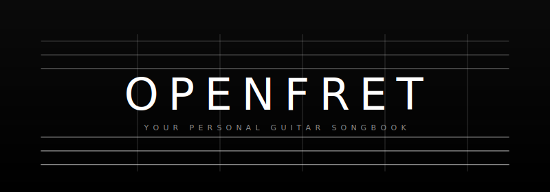

# OpenFret

**Your personal guitar songbook. Bring your own songs. Runs in your browser.**

OpenFret is a free, open-source, single-page songbook for guitar players. It runs entirely in the browser, no account, no ads, no tracking. Add your own songs, tune your guitar, run a metronome, drill scales, and practice with backing tracks, all in one page that you host yourself or run from a single HTML file.



## Try it now

Pick the easiest path for you:

- **GitHub Pages** (1 minute, recommended): fork this repo, then in your fork go to **Settings → Pages → Source: GitHub Actions**. The included workflow will publish your songbook at `https://YOUR-USERNAME.github.io/openfret/`.
- **Netlify** (drag and drop): go to [app.netlify.com/drop](https://app.netlify.com/drop), drag the `openfret/` folder onto the page, done.
- **Vercel**: install the [Vercel CLI](https://vercel.com/docs/cli), run `vercel` inside the `openfret/` folder, follow the prompts.
- **Local only**: open `index.html` in your browser, or for full microphone support run `python3 -m http.server 8000` and open `http://localhost:8000/`.

There is no build step. No npm install required. The whole app is plain HTML, CSS, and JavaScript.

## What you get

- **Songbook** with search, large-text reading mode, and auto-scroll for hands-free playing
- **In-browser library**: add, edit, and delete your own songs with a simple form. No file editing required.
- **Backup and sync**: export your library as a single JSON file, import on another device
- **10 public-domain sample songs** so the app feels alive on first run (folk, blues, jazz, rock arrangements). Hide them anytime.
- **Microphone tuner** with cents accuracy and a hold-in-tune indicator
- **Reference notes** for all six strings (E A D G B E)
- **Metronome** with tap tempo, presets, and configurable beats per bar
- **Pentatonic scales reference** with five fretboard patterns
- **Chord chart** with major, minor, 7th, sharp/flat, extended, and power chords
- **Practice tab** with backing track player, fretboard note quiz, and interval ear training

## Add your first song

1. Open OpenFret in your browser.
2. Tap **+ Add Song** in the header.
3. Fill in title, artist, chords, and lyrics. Wrap each chord in square brackets right before the syllable it falls on:
   ```
   [G]Heading [D]down south to the [Em]land of the [C]pines
   ```
4. Save. Your song appears at the top of the list.

Your songs are stored in your browser's `localStorage`, so they live on your device only. To back them up or move them to another device, open **Library → Export to file**. To restore, use **Library → Import & Merge**.

## Project layout

```
openfret/
├── index.html              app markup, modals, all UI structure
├── styles/main.css         app styles
├── data/sample-songs.js    bundled public-domain sample songs
├── js/
│   ├── library.js          localStorage CRUD + JSON import/export
│   ├── onboarding.js       welcome banner + help modal
│   └── app.js              main runtime (tuner, metronome, songbook, practice)
├── assets/                 header SVG, favicon
├── songs/                  optional drop-in JSON folder for power users
├── tests/                  Jest + Node smoke tests
├── .github/workflows/      GitHub Pages auto-deploy
├── netlify.toml            Netlify config
├── vercel.json             Vercel config
├── README.md
├── LICENSE                 MIT
├── CONTRIBUTING.md
├── CODE_OF_CONDUCT.md
└── CHANGELOG.md
```

## Sample songs

OpenFret ships with 10 verified public-domain songs across folk, blues, jazz, and rock-style arrangements. Each entry includes a `license` field with the source attribution.

| Title | Artist | Genre | License |
|---|---|---|---|
| Amazing Grace | John Newton (Traditional) | Folk | PD lyrics 1779 |
| House of the Rising Sun | Traditional | Folk / Rock arrangement | PD traditional |
| Scarborough Fair | Traditional English | Folk | PD 16th century |
| Auld Lang Syne | Robert Burns | Folk | PD 1788 |
| Oh! Susanna | Stephen Foster | Folk | PD 1848 |
| St. Louis Blues | W.C. Handy | Blues | PD 1914 |
| St. James Infirmary | Traditional | Blues | PD 1928 |
| Nobody Knows You When You're Down and Out | Jimmy Cox | Blues | PD 1923 |
| When the Saints Go Marching In | Traditional | Jazz | PD spiritual |
| Sweet Georgia Brown | Bernie, Pinkard & Casey | Jazz | PD 1925 |

If you'd rather start with a clean slate, open **Library → Hide Sample Songs** at any time. Your own songs are unaffected.

## Customize the look

- **Header image**: replace `assets/openfret-header.svg` with your own logo.
- **Title and tagline**: edit the `<title>` and `<h1>` in `index.html`.
- **Colors**: theme colors live in `styles/main.css` near the top. The default is a high-contrast dark theme.
- **Tabs**: remove a tab by deleting its `<button class="nav-tab">` in `index.html` and the corresponding section.

## Roadmap

Planned, but not yet built:

- Song-level transposition (one click to shift the whole song up or down a key)
- Capo helper (pick a capo position, see chord shapes)
- Multi-device sync via a shareable URL with the song JSON encoded
- Print-friendly stylesheet
- PWA install with offline support
- Optional chord diagrams inline with the lyrics

PRs welcome. See [CONTRIBUTING.md](CONTRIBUTING.md).

## Browser support

Tested on the current versions of Chrome, Safari, Firefox, and Edge. The microphone tuner requires HTTPS or `localhost` per browser security rules. iOS Safari supports everything; the splash screen tap unlocks audio for the tuner and metronome.

## Privacy

Your songs never leave your device. There is no server, no telemetry, no third-party scripts, and no cookies. The only network requests are for the page assets themselves.

## License

OpenFret is [MIT licensed](LICENSE). The bundled sample songs are individually marked as public domain in `data/sample-songs.js`.

## Credits

Forked from a personal songbook project by Adam Werbach. Made open-source so anyone can have a no-fuss, no-account guitar songbook of their own. If you ship a customized version, a link back to this repo is appreciated but not required.

## Showcase

Are you using OpenFret? Open a PR adding your deployment to this list. We love seeing what people do with it.

- _Your songbook here._
